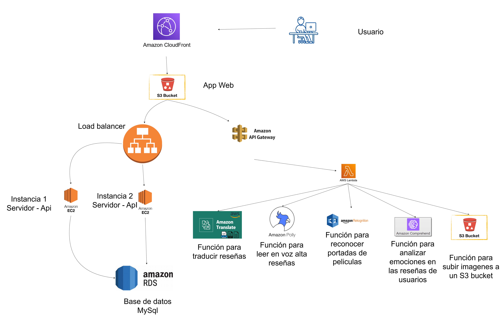
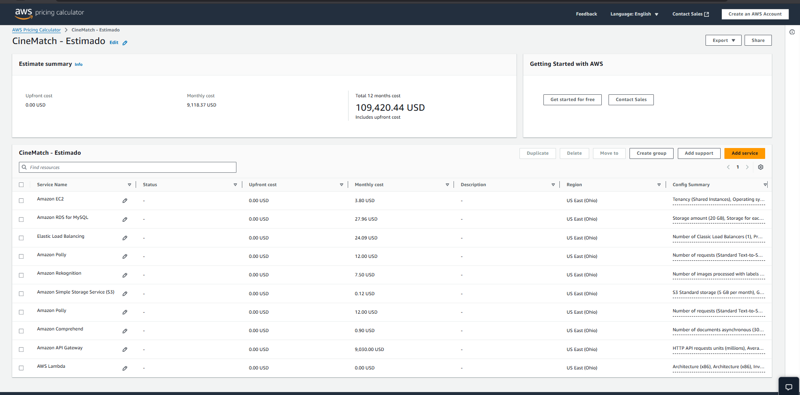

# Laboratorio Seminario de Sistemas 1
# Grupo 4 - Manual Técnico

## 1. Miembros del grupo

| Carné      | Nombre completo                      |
|------------|--------------------------------------|
| 201801391  | Luis Fernando Gomez Rendon           |
| 201700753  | Carlos Eduardo Carrera Aguilar       |
| 201612218  | Susan Pamela Herrera                 |
| 201906099  | Daniel Moisés Chan Pelico            |

## 2. Objetivos del proyecto
## 3. Descripción del proyecto
## 4. Arquitectura implementada

## 5. Presupuesto del proyecto
El presupuesto del proyecto se realiza utilizando la herramienta AWS Pricing Calculator. Ver presupuesto detallado [Presupuesto](https://calculator.aws/#/estimate?id=49cc2c6c5e3d9228004a82932d301c04b2540c8d)

## 6. Servicios utilzados
### 6.1 Amazon EC2 (Elastic Compute Cloud)
Descripción:
Amazon EC2 es un servicio que permite ejecutar máquinas virtuales (instancias) en la nube de AWS. Brinda capacidad de cómputo escalable bajo demanda, permitiendo ejecutar aplicaciones sin necesidad de comprar hardware físico.

Características principales:

- Elección de sistema operativo (Linux, Windows, etc.).
- Tipos de instancias optimizadas para CPU, memoria o almacenamiento.
- Escalado automático mediante Auto Scaling Groups.
- Integración con Amazon EBS (volúmenes persistentes).
- Facturación por uso (“pago por hora o segundo”).

Casos de uso:

- Servidores web y de aplicaciones.
- Entornos de desarrollo o pruebas.
- Procesamiento de grandes volúmenes de datos.
- Ejecución de contenedores o microservicios.

Ventajas:

- Alta disponibilidad y escalabilidad.
- Integración con otros servicios AWS.

### 6.2 Amazon Load Balancer (Elastic Load Balancing – ELB)
Descripción:
Distribuye automáticamente el tráfico entrante entre múltiples instancias de EC2, contenedores u otros destinos, mejorando la disponibilidad y tolerancia a fallos.

Tipos de Load Balancer:

- ALB (Application Load Balancer): para tráfico HTTP/HTTPS.
- NLB (Network Load Balancer): para tráfico TCP/UDP de alto rendimiento.
- GLB (Gateway Load Balancer): para servicios de red como firewalls o proxies.

Casos de uso:

- Balanceo de carga de aplicaciones web.
- Escenarios de alta disponibilidad.
- Integración con Auto Scaling.

Ventajas:

- Escalado automático.
- Monitoreo de salud de instancias.
- Distribución inteligente del tráfico.

### 6.3 Amazon S3 (Simple Storage Service)
Descripción:
Servicio de almacenamiento de objetos que permite guardar y recuperar cualquier cantidad de datos en cualquier momento. Ideal para copias de seguridad, contenido multimedia, registros o big data.

Características:

- Almacenamiento prácticamente ilimitado.
- Altamente duradero (99.999999999% de durabilidad).
- Versionado de objetos.
- Control de acceso mediante políticas IAM y buckets.

Casos de uso:

- Almacenamiento de imágenes, videos, documentos.
- Respaldos y recuperación ante desastres.
- Hosting de sitios web estáticos.
- Almacenamiento para análisis con Amazon Athena o Redshift.

Ventajas:

- Escalabilidad automática.
- Seguridad y cifrado integrados.
- Bajo costo por GB almacenado.

### 6.4 Amazon Translate
Descripción:
Servicio de traducción automática neural que convierte texto entre múltiples idiomas con alta precisión.

Características:

- Traducción en tiempo real o por lotes.
- Soporte para más de 70 idiomas.
- Compatible con archivos y flujos de datos.

Casos de uso:

- Localización de contenido web o apps.
- Traducción de chats o correos.
- Análisis multilingüe de datos (junto con Comprehend).

Ventajas:

- Rápido y económico.
- Alta calidad de traducción con redes neuronales.
- Integración con S3, Lambda y otros servicios.

### 6.4 Amazon Polly
Descripción:
Convierte texto en voz realista mediante tecnologías de text-to-speech (TTS).

Características:

- Más de 30 idiomas y más de 60 voces.
- Soporte para Speech Marks (pausas, emociones, etc.).
- Exportación en formatos MP3 u OGG.

Casos de uso:

- Lectura automática de artículos o libros.
- Asistentes virtuales.
- Aplicaciones inclusivas (accesibilidad).

Ventajas:

- Voces naturales y personalizables.
- Generación bajo demanda o por lotes.
- Escalable y de bajo costo.

### 6.4 Amazon Comprehend
Descripción:
Servicio de procesamiento de lenguaje natural (NLP) que usa machine learning para analizar texto y extraer significado.

Características:

- Detección de sentimientos (positivo, negativo, neutro).
- Extracción de entidades (personas, lugares, organizaciones).
- Clasificación de temas y frases clave.
- Análisis multilingüe.

Casos de uso:

- Análisis de opiniones en redes sociales.
- Detección de entidades en documentos.
- Automatización de soporte al cliente.

Ventajas:

- No requiere entrenar modelos manualmente.
- Compatible con datos en S3 y bases de datos AWS.
- Escalable y personalizable.

### 6.4 Amazon Rekognition
Descripción:
Servicio de visión artificial que analiza imágenes y videos usando redes neuronales profundas.

Características:

- Detección de rostros, objetos, textos o escenas.
- Comparación y reconocimiento facial.
- Moderación de contenido.
- Análisis de video en tiempo real.

Casos de uso:

- Sistemas de seguridad.
- Catalogación automática de imágenes.
- Filtrado de contenido inapropiado.

Ventajas:

- Precisión alta sin necesidad de entrenar modelos.
- Integración con S3, Lambda y Kinesis Video Streams.
- Escalabilidad y análisis en tiempo real.

### 6.4 Amazon Api Gateway
Descripción:
Permite crear, publicar y gestionar APIs de forma segura y escalable. Es un punto de entrada para microservicios o backends sin servidor.

Características:

- Soporta REST, HTTP y WebSocket APIs.
- Control de acceso con IAM, Cognito o tokens personalizados.
- Límite de peticiones, caché y monitoreo integrado.

Casos de uso:

- Creación de APIs para apps móviles o web.
- Integración con AWS Lambda (arquitectura serverless).
- Proxy para microservicios.

Ventajas:

- Escalable automáticamente.
- Seguridad integrada.
- Compatible con múltiples protocolos.